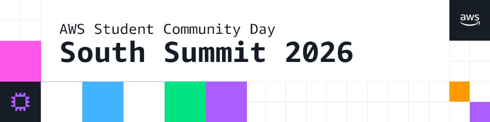

# AWS SCD South Summit 2026 — Photobooth 📸⚡

An interactive, event-branded web photobooth for **AWS Student Community Day: South Summit 2026** (*Cloud × AI: Build. Grow. Lead.*). Built with vanilla HTML5, CSS3, and JavaScript, designed around the South Summit visual language.



---

## 🚀 Features

- **Live Camera Feed & Controls**: Toggle front/back cameras (`Flip`), capture photos, and preview frames in real-time.
- **2 Capture Modes**:
  - **Single Photo**: Snapshot with a 3-second countdown.
  - **Strip ×3**: Sequentially captures 3 photos with countdowns and composites them into a vertical AWS-branded photo strip.
- **Custom Event Frames**:
  - **Summit Gradient** (AWS Blue, Purple, Orange gradient with footer mark)
  - **AWS Brand Colors** (Blue, Orange, Pink, Green, Purple)
  - **Pixel Frame** (Cyberpunk grid border)
- **Interactive Emoji Stickers**: 16 draggable, removable stickers (🚀 ☁️ ⚡ 🔥 💡 🤖 🎯 💻 🌟 🏆 🎉 🧠 📡 🔮 ⚙️ 🌐). Click to add, drag to position, double-click to remove.
- **Custom Captions & Color Picker**: Add personalized event text with 7 color swatches.
- **Session Gallery**: Local gallery to preview, re-download, or delete saved photos.
- **High-Quality PNG Downloads**: Exports full-resolution PNG images directly to your device.
- **Theme Switching**: Dark and Light mode toggle with persisted state in `localStorage`.

---

## 📁 Project Structure

```
AWS SCD SUMMIT - PHOTOBOOTH/
├── index.html              # Main HTML entry point
├── css/
│   ├── theme.css           # Global theme tokens (colors, grid background, dark/light variables)
│   └── photobooth.css      # Photobooth layout & UI component styles
├── js/
│   └── photobooth.js       # Camera handling, canvas composition, sticker & download logic
├── assets/                 # Brand SVG & PNG logos
│   ├── awssbg-logo.svg
│   ├── amazon-aws-logo.png
│   ├── amazon-q-seeklogo.svg
│   ├── sbg-calabarzon-logo.png
│   └── Event-Primer.png
├── package.json            # Node.js manifest & scripts
├── vercel.json             # Vercel deployment configuration
├── .editorconfig           # Formatting rules
├── .gitignore              # Git ignore rules
├── LICENSE                 # MIT License
└── README.md               # Project documentation
```

---

## 🛠️ Local Development

Camera access (`getUserMedia`) requires a secure context (`HTTPS` or `http://localhost`).

### Option 1: Using `npm` / `npx`
```bash
# Clone the repository
git clone https://github.com/your-username/aws-scd-south-summit-photobooth.git
cd aws-scd-south-summit-photobooth

# Start local server on http://localhost:3000
npm start
```

### Option 2: VS Code Live Server
1. Open the project folder in VS Code.
2. Click **Go Live** via the [Live Server](https://marketplace.visualstudio.com/items?itemName=ritwickdey.LiveServer) extension.
3. Open `http://127.0.0.1:5500` in your browser.

---

## 🌐 Deployment

### Deploy to Vercel
1. Push your code to GitHub.
2. Import the repository in [Vercel](https://vercel.com/new).
3. Vercel will automatically detect `index.html` and deploy your photobooth with HTTPS enabled.

### Deploy to GitHub Pages
1. Go to repository **Settings** -> **Pages**.
2. Set source to `main` branch / `/root`.
3. Save and open the generated HTTPS URL.

---

## 🎨 Theme Palette

| Color | Hex | Role |
|---|---|---|
| **AWS Blue** | `#44B3FE` | Primary accent, chip marks |
| **AWS Purple** | `#A759FF` | Secondary accent |
| **AWS Orange** | `#FC9907` | Primary buttons & highlights |
| **AWS Green** | `#07E383` | Accent highlights |
| **AWS Pink** | `#FE57EA` | Brand boxes |
| **Ink Block** | `#161C24` | Dark mode base & footers |

---

## 📜 License

Distributed under the [MIT License](LICENSE). Copyright © 2026 AWS Student Builder Groups — South Luzon.
